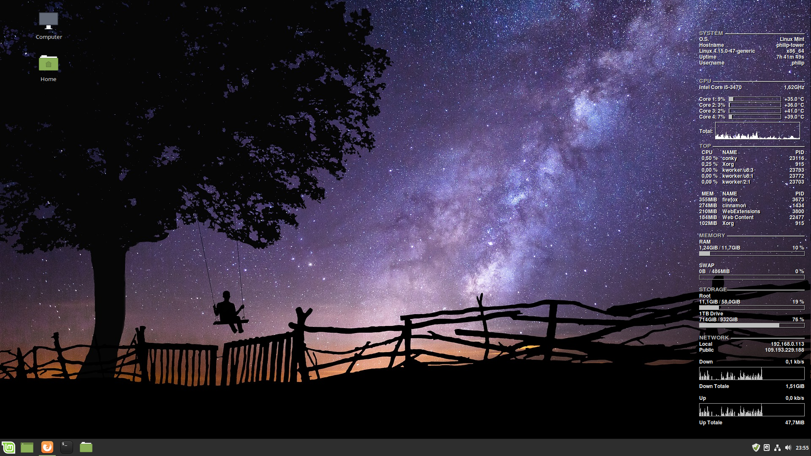
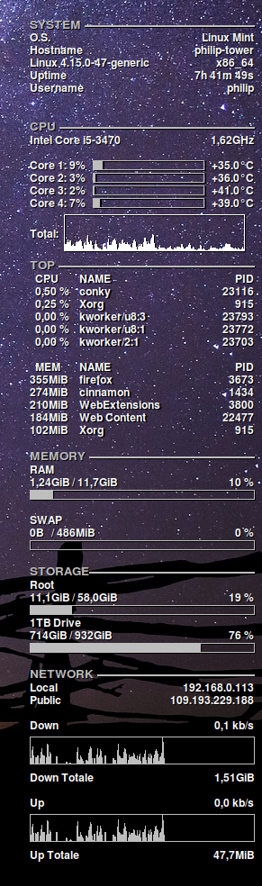

# Conky-Minimalistic Config



# Install

- install conky
- check if conky start via terminal command: conky
  - if yes proceed, else install it the right way! (add path to enviroment variable)
- unzip the archive
- give install.sh rights to be executable and execute:
```bash
chmod +x install.sh
./install.sh
```
- "conky.conf" and "conky-startup.sh" will be copied into ~/.config/conky/minimalistic/
- edit your LAN/WIFI interfacename, number of CPU's (and CPU name), HDD/SSD names, OS Name
- you can start conky with this setup via:
```bash
~/.config/conky/minimalistic/./conky-startup.sh
```

# Autostart

If you want to add conky with this setup to your autostart, type the following in your terminal:

```bash
chmod +x add2autostart.sh
./add2autostart.sh
```

# Credits

[ilnanny](http://ilnanny.deviantart.com/), he made the most of the work. I just edited his stuff to my needs and wrote the install instructions
